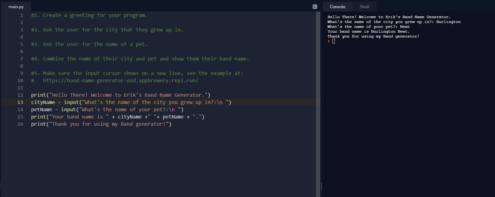
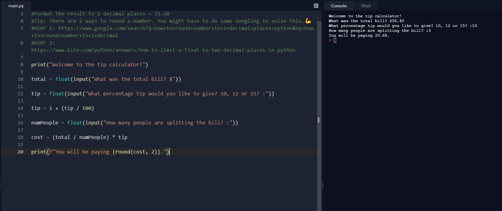

# 100 Days of Code / Erik Martinez
## Basic Variables and Functions
### Day 1: June 1, 2021 - Tuesday

**Today's Progress:**

- Review on printing, strings, the input function, variables and variable naming.
- Recreated a small project called the band name generator. It focused on the storing of strings with the input 
  function and string concatenation.(Screenshot below)

---

## Data Types and Operations
### Day 2: June 2, 2021 - Wednesday

**Today's Progress:**
- Looking at the basic data types of Python and the mathematical operations.
- Recreated a tip calculator using principles covered today.

---

## Control Flow
### Day 3: June 3, 2021 - Thursday

**Today's Progress**
- Came back to control flow, reviewing if/else statements and basic logic.
- For the final project of the day I created a word adventure game. You make choices which change the outcome of 
  your journey. This is done mostly with input and print functions and control flow.
  
---

## Random and Lists
### Day 4: June 4, 2021 - Friday

**Today's Progress**
- Looked at generating random numbers and how to work with lists (appending or modifying)
- Worked on a rock, paper, scissors game, where you play against your program. It was a fun way to summarze 
  everything I reviewed today.
- I am close to getting out of my comfort zone with python. Looking forwards to the challenge.  

---

## Python Loops
### Day 5: June 5th, 2021 - Saturday

**Today's Progress**
- Today was focused on Python loops and the new functions they come with.
- Created a password generator for the final project.

---

## Functions and While Loops
### Day 6: June 6th, 2021 - Sunday

**Today's Progress**
- Today's learning was on functions and while loops. Anything after this is undiscovered python territory for me.

---

## Hangman
### Day 7: June 7th, 2021 - Monday

**Today's Progress**

- Today was focused on the creation of the game Hangman. The lessons today were on separate mechanics of the game. 
This was cool to work on the different parts of the game and put it all together.

---

## Function Parameters & Caesar Cipher
### Day 8: June 8th, 2021 - Tuesday

**Today's Progress**
- Today I covered inputs for functions types of arguments, and encryption and decryption.
- I Made a paint area calculator and a prime number checker.

---

## Python Dictionaries and Auction System
### Day 9: June 9th, 2021 - Wednesday

**Today's Progress**
- Today I learned about python dictionaries and created an auction system.

---

## Function Outputs
### Day 10: June 10th, 2021 - Thursday

**Today's Progress**
- Today was focused on the outputs of functions using return.
- Created calculator as final project.

---

## Black Jack Capstone Project
### Day 11: June 11th, 2021 - Friday

**Today's Progress**
- Today was focused on the Black Jack capstone project. Falling behind due to bad habits and procrastination.

---

## Scope and Number Guessing Game
### Day 12: June 12th, 2021 - Saturday

**Today's Progress**
- Data storage was the topic for today. I covered global variables, constants and scope.
- Created number guessing game for the final project.

---

## Debugging
### Day 13: June 13th, 2021 - Sunday

**Today's Progress**
- Today's learning was focused on debugging code and general tip on the tools and features that could help. 

---

## Higher/Lower Game Project
### Day 14: June 14th, 2021 - Monday

**Today's Progress**
- Today was focused on a higher/lower game. Nice and short lessons today, but still fun to do.

---

## PyCharm and Coffee Machine Project
### Day 15: June 15th, 2021 - Tuesday

**Today's Progress**
- Today was focused on getting started on using PyCharm for the course and the Coffee Machine Project.

---

## Object-Oriented Programming
### Day 16: June 16th, 2021 - Wednesday

**Today's Progress**
- Today we looked at Object-Oriented Programming. We covered what classes and objects are and how to use them.
- This is familiar because of my previous experience from school and using OOP with Java, just different syntax.

---

## Creating Classes and Quizzing Game
### Day 17: June 17th, 2021 - Thursday

**Today's Progress**
- Today we focused on creating classes, class methods and constructors.
- The main project was creating a quizzing game that highlighted a classes abilities.

---

## Graphical User Interface
### Day 18: June 18th, 2021 - Friday

**Today's Progress**
- Working on GUI on python and being introduced to the new properties.

---

## Instances, State and Higher Order Functions.
### Day 19: June 19th, 2021 - Saturday

**Today's Progress**
- Was introduced to higher order functions and learned about the turtle coordinate system.
- Got a new keyboard, feeling more motivated to code with it.

---

## The Snake Game Pt. 1
### Day 20: June 20th, 2021 - Sunday

**Today's Progress**
- Failed to mention in tweet that it is a two part project.
- Working with GUI, OOP and user input to control the snake.

---

## The Snake Game Pt. 2
### Day 21: June 21st, 2021 - Monday

**Today's Progress**
- Working on part 2 of the snake game project.
- Learned class inheritance, and worked on game mechanics for the snake.

---

## The Pong Game
### Day 22: June 22nd, 2021 - Tuesday

**Today's Progress**
- Today was spent on the recreation of the old school video game pong.
- Mainly Used OOP to recreate this game.

---

## Turtle Crossing Capstone
### Day 23: June 23rd, 2021 - Wednesday

**Today's Progress**
- Today was for the Turtle Crossing Capstone Project.
- Broke down the game and it's properties.

---

## File, Directories and Paths
### Day 24: June 24th, 2021 - Thursday

**Today's Progress**
- Today was spent on learning more about files and directories.
- Never focused more on a projects files, pretty new to me.
---

## CSV Data, Pandas Library
### Day 25: June 25th, 2021 - Friday

**Today's Progress**
- CSV Data sounded completely foreign, but the instructor did a good job in explaining.
- I am slacking off with tweets and updating my repo. I am looking to add second repo for code.
- Created a game for the final project.
---

## List Comprehension and the NATO Alphabet
### Day 26: June 26th, 2021 - Saturday

**Today's Progress**
- Learned about the NATO alphabet.
- I keep on repeating my self and saying this is new to me... all of it will be new to me.

---

## Tkinker and GUI Programs
### Day 27: June 27th, 2021 - Sunday

**Today's Progress**
- Was introduced to Tkinter for GUI
- Learned about *args and **kwargs.

---

## Pomodoro GUI Application
### Day 28: June 28th, 2021 - Monday

**Today's Progress**
- Created the Pomodoro GUI Application
- Used modular programming for the completion of the project.
- Timers used for this application.

---

## Password Manager GUI App with Tkinter
### Day 29: June 29th, 2021 - Tuesday

**Today's Progress**
- Created a password manager app with Tkinter.
- Images and saving data was used in the making of the application.

---

## Error Handling, Exceptions and JSON Data
### Day 30: June 30th, 2021 - Wednesday

**Today's Progress**
- Today was spent on dealing with errors.
- Updated the password manager application with exception handling and the use of JSON data.

